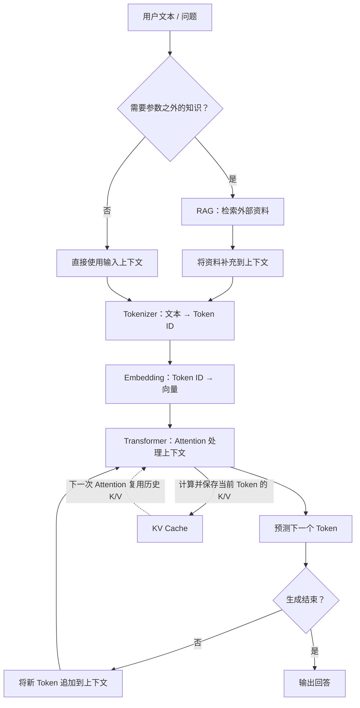
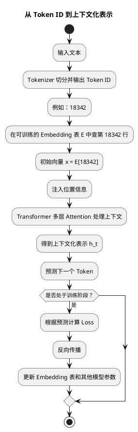

# 从 Token 到 RAG：我初步搭起的大模型基础认知地图

> 这是一篇面向入门学习者的学习复盘，作为向Agent方向转变的第一步，旨在搞懂这些耳熟能详的基本概念，以及梳理它们在一次大模型回答中如何连接。

## 1. 为什么开始学这些

- 我是一名典型的学院派，一直以来秉承的思想是，如果要弄懂一个领域的知识，那么一定要从它最基础的概念开始学起。LLM、Agent大家都会用，但模型是如何理解文字，又是如何生成答案的？我想要搞懂这些。
- 这一周我学习的范围覆盖到了LLM基础的一些概念：Token、Embedding、Transformer、Attention、RAG、KV Cache。
- 这篇文章的目标：建立一张可回看的LLM基础认知地图。

## 2. 先给出总图：一次回答是怎样产生的

先概括全链路：

> 文本先被切成 Token（数字），Token 被转换为 Embedding（向量）；Transformer 通过 Attention 处理上下文，再逐个预测后续 Token。当模型需要参数之外的知识时，RAG 会先检索外部资料并补充到上下文；在连续生成时，KV Cache 会复用已经计算过的历史信息，避免重复计算。



## 3. 六个概念：我分别理解了什么

每个小节都按以下顺序展开：

- 它解决什么问题
- 我现在如何理解这个概念
- 它与前后概念怎样连接
- 我原先的误解或仍未解决的疑问

### 3.1 Token：模型先看到的不是文字

LLM的一大优势，是它能够理解人类的自然语言，并且以自然语言跟人类进行交互。站在LLM的视角，它真正理解的并不是英文单词、中文的汉字，而是以ID形式存在的Token。

Token 与单词/汉字并不是一一对应的关系，以英文为例，“空格+单词“、”词组“都可以成为token。自然语言被转换成token，输入给LLM。LLM生成token后，又被转换回自然语言，返回给人类。这个步骤叫做Tokenizer。

Tokenizer的算法，与模型之间是互相独立的，这意味着不同的模型可以采用相同或者不同的 Tokenizer。比较典型的例子是，GPT2所采用的Tokenizer词表仅有50k大小，对于中文的处理就不是很好，会导致大量切分。GPT4o之所以在中文互联网广泛传播，与它所使用的Tokenizer在中文方面的提升密不可分。

不同模型的词表大小如下表所示：

| 模型系列            |                   Tokenizer | Vocabulary Size（约） |
| --------------- | --------------------------: | -----------------: |
| GPT-2           |           BPE (`r50k_base`) |             50,257 |
| GPT-3           |                 `p50k_base` |             50,281 |
| GPT-3.5 / GPT-4 |               `cl100k_base` |            100,256 |
| GPT-4o          |                `o200k_base` |           ~200,000 |
| GPT-5.x         | **未公开**，通常认为沿用 **o200k 级别** |                    |

可以使用 https://gpt-tokenizer.dev/ 网站，在线查看一句提示词所生成的 Token 数量、详情。

### 3.2 Embedding：离散 ID 如何进入连续计算

在Tokenizer过程中，自然语言被转换为计算机能够处理、存储的整数 ID。但 ID 只是离散索引：它的大小和与其他 ID 的差值都不包含词义，不能直接支持模型学习语义关系。

因此我们需要为Token赋予多层次、多维度下的含义，这里使用的是 **向量（Vector）**。将 Token 进行向量化的过程，就叫做 **Embedding（词嵌入）**。

例如，`18342` 与 `18343` 的数值接近，并不表示两个 Token 的含义接近。模型需要把这个索引转换为能参与连续数值计算的表示。

#### Embedding 的本质：一张可训练的查找表

Embedding 并不是把 Token 放进某个复杂公式后“算出”向量，而是从一个巨大的、可训练的 **Embedding 表**中查出对应的一行。若词表大小为 `V`，每个向量的维度为 `d`，这张表可写成：

$$
E \in \mathbb{R}^{V \times d}
$$

例如，假设一个模型有 `50,000` 个 Token、每个 Token 用 `768` 个数表示，那么 `E` 就是一张 `50,000 × 768` 的参数表。Tokenizer 为某个 Token 分配 ID `18342` 后，模型取出第 `18342` 行：

```text
Token ID: 18342
    ↓ 查表
E[18342] = [0.18, -0.74, 0.51, ..., 0.09]  # 共 768 个数
```

也就是说，代码层面的直觉接近于 `vector = embedding[tokenId]`。实现中不会真的先构造 one-hot 向量再相乘；但在数学上，“取第 `tokenId` 行”与 one-hot 向量乘以矩阵 `E` 是等价的。

一段 Token ID 序列会得到一段初始向量序列。例如 `[42, 317, 8]` 会从表中取出三行，组成一个 `3 × 768` 的矩阵。此时，每个向量仍只是与 Token ID 对应的**静态起点**，尚未结合这次句子的上下文。



#### Embedding 表中的数字是谁决定的？

它们不是工程师逐个填写的。训练开始时，Embedding 表的数值通常是随机初始化的；模型在大量文本上反复执行“根据前文预测下一个 Token”。预测偏离真实答案时，Loss 会通过反向传播更新模型参数，其中也包括 Embedding 表中本次计算涉及的行。经过大量训练，这些行逐渐形成对训练任务有用的统计结构。

因此，向量空间中相近的 Token 往往在训练语料中具有相似的上下文分布；但“向量距离近”只是一种统计上的相似信号，不是词义真值，也不能单独证明逻辑关系。

#### 静态的初始向量，不等于模型已经理解了上下文

对同一个模型版本而言，同一个 **Token ID** 每次都会查到 Embedding 表中的同一行。比如一个 Token 在“我吃了苹果”和“苹果发布了新产品”中，如果它恰好是同一个 Token ID，那么初始向量相同。真正随语境变化的是后续 Transformer 层产生的 hidden state：Attention 会结合周围 Token，使两个位置得到不同的上下文化表示。

这里的前提是“同一个 Token ID”。大小写、空格和不同 Tokenizer 都可能让看起来相同或相近的文字被切成不同 Token，因而查到不同的行。

可以把 Embedding 类比成字典中固定的词条入口；Transformer 则是在完整句子中判断这个词此刻具体表达什么。前者提供连续计算的起点，后者才承担根据上下文“重新赋义”的工作。

### 3.3 Attention：当前位置如何关注上下文

- Attention 要解决的核心问题是什么？
- 当前 Token 如何根据任务需要，从上下文中选择相关信息？
- 为什么 decoder-only 模型需要因果遮罩，不能提前看到未来 Token？

在上一步 Embedding 中，系统将 Token ID 

### 3.4 Transformer：把 Attention 组织成生成模型

- Transformer 在整条链路中承担什么角色？
- 输入向量经过多层处理后，如何变成对下一个 Token 的预测？
- 大模型输出并非一次完成，而是“预测一个 Token，再把它放回输入”地循环生成。

### 3.5 RAG：模型需要外部知识时怎么办

- RAG 解决的不是模型如何理解语言，而是模型如何访问参数之外、可更新的资料。
- 检索到的文本怎样成为生成时的上下文？
- RAG 不等于“模型一定正确”，也不等于长期记忆；检索质量、上下文组织与验证仍然重要。

### 3.6 KV Cache：生成时如何避免反复计算

- 自回归生成为什么会产生大量重复计算？
- KV Cache 缓存的是什么，为什么它不是 HashMap 或答案缓存？
- 它用显存换计算，但为什么不能消除长上下文带来的成本？

## 4. 把它们串起来：从提问到回答的过程

以“用户输入一个问题”为例，按时间顺序重新串起上面的概念：

1. 输入文本被切分为 Token。
2. Token ID 经 Embedding 转为向量，并加入位置信息。
3. Transformer 通过 Attention 处理当前上下文，得到预测下一个 Token 的表示。
4. 模型选出一个下一个 Token，拼回前缀后继续生成。
5. 如果问题需要外部资料，RAG 会在生成前检索相关内容并补入上下文。
6. 在持续生成的过程中，KV Cache 复用历史 Token 的 attention 中间结果。

这一节要明确两点：RAG 是围绕外部知识的系统能力，KV Cache 是围绕推理效率的运行时机制；它们都服务于生成，但不属于 Transformer 的同一层级。

## 5. 这一周最大的认知变化

从自己的真实感受出发，而不是重复术语定义。可以围绕以下变化写：

- 我不再把“模型理解语言”笼统地看成黑箱，而是开始理解它在 Token、向量表示和概率预测中发生。
- 我开始把 Attention 理解为当前 Token 从上下文获取信息的计算机制，而不只是一个抽象名词。
- 我意识到 RAG 的价值是为当前任务组织外部证据，而不是替模型保证正确答案。
- 我理解了 KV Cache 是推理资源管理的一部分：它加速生成，也带来显存和长上下文的约束。

## 6. 仍未解决的问题，以及下一步

如实保留尚未理解的部分，为下一轮学习留下入口：

- 位置信息（例如 RoPE）具体如何让模型感知顺序？
- 训练阶段与推理阶段的 Transformer 计算分别有什么差异？
- 上下文窗口变长后，模型为什么不一定能稳定利用所有信息？
- 向量检索、重排与上下文拼装分别怎样影响 RAG 的效果？
- KV Cache 的显存占用在真实服务中如何管理？

## 结语

用一两段话回扣全文：这周的收获不是记住了六个术语，而是初步建立起“文本如何进入模型、模型如何利用上下文、何时使用外部知识、如何更高效生成”的整体链路。后续学习将继续补全其中仍然模糊的环节。
