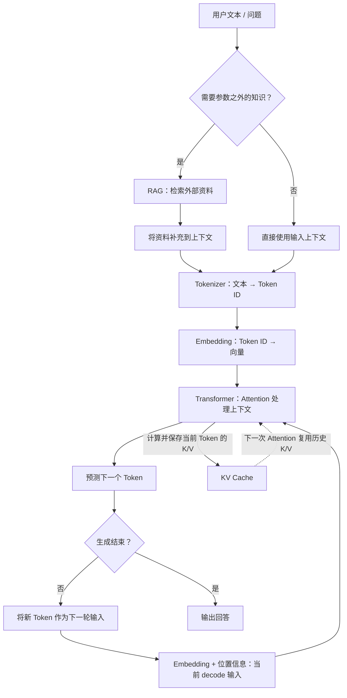
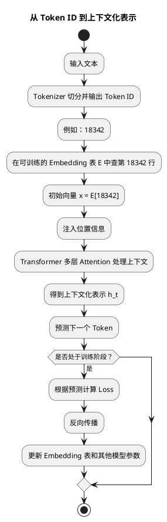
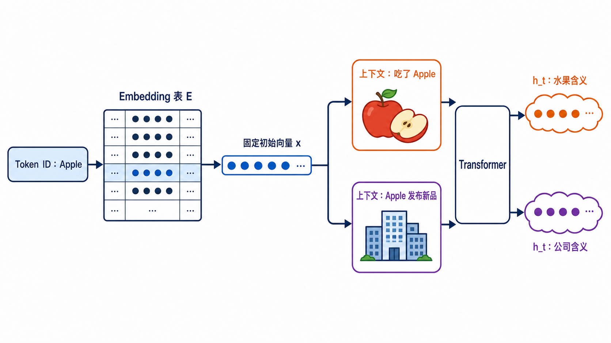
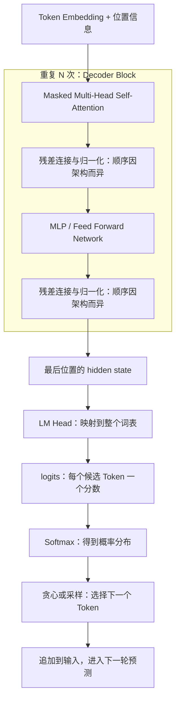
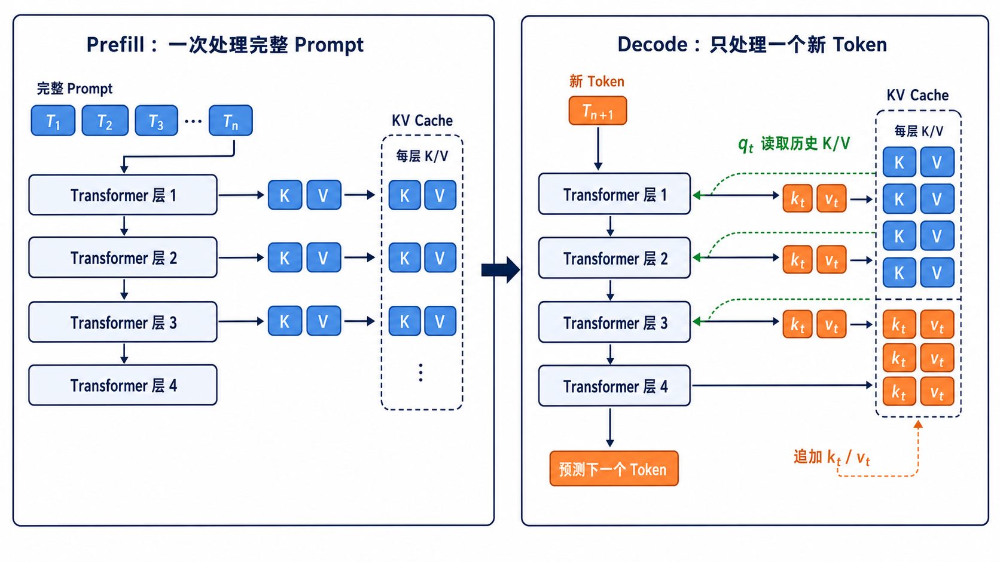
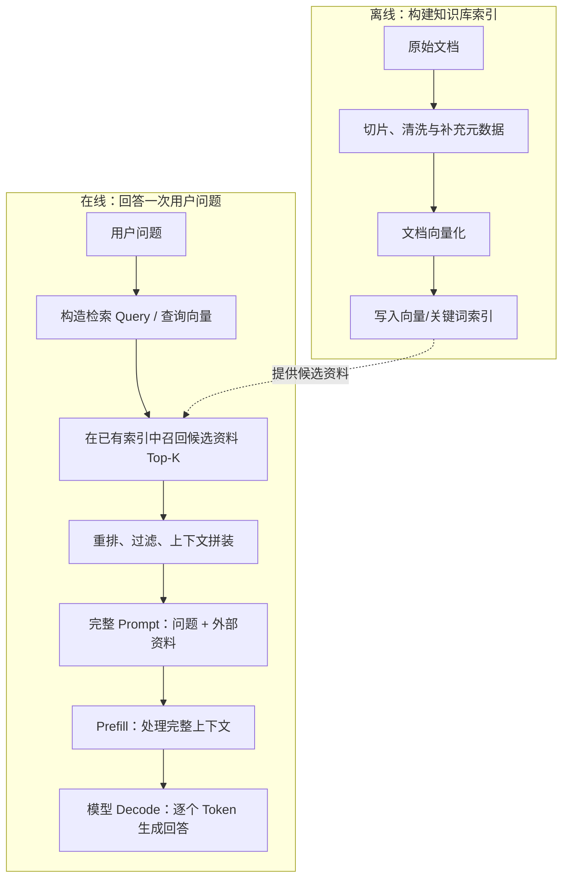

# 从 Token 到 RAG：我这一周搭起的大模型基础认知地图

> 这是一篇面向入门学习者的学习复盘，作为向Agent方向转变的第一步，旨在搞懂这些耳熟能详的基本概念，以及梳理它们在一次大模型回答中如何连接。

## 1. 为什么开始学这些

- 我是一名典型的学院派，一直以来秉承的思想是，如果要弄懂一个领域的知识，那么一定要从它最基础的概念开始学起。LLM、Agent大家都会用，但模型是如何理解文字，又是如何生成答案的？我想要搞懂这些。
- 这一周我学习的范围覆盖到了LLM基础的一些概念：Token、Embedding、Transformer、Attention、RAG、KV Cache。
- 这篇文章的目标：建立一张可回看的LLM基础认知地图。

## 2. 先给出总图：一次回答是怎样产生的

先概括全链路：

> 文本先被切成 Token（数字），Token 被转换为 Embedding（向量）；Transformer 通过 Attention 处理上下文，再逐个预测后续 Token。当模型需要参数之外的知识时，RAG 会先检索外部资料并补充到上下文；在连续生成时，KV Cache 会复用已经计算过的历史信息，避免重复计算。



## 3. 六个概念：我分别理解了什么

每个小节都按以下顺序展开：

- 它解决什么问题
- 我现在如何理解这个概念
- 它与前后概念怎样连接
- 我原先的误解或仍未解决的疑问

### 3.1 Token：模型先看到的不是文字

LLM 的一大优势，是它能够理解人类的自然语言，并且以自然语言跟人类进行交互。站在模型的计算视角，它直接接收的不是英文单词或中文汉字，而是以 ID 形式存在的 Token；语义处理发生在后续的连续表示和上下文化计算中。

Token 与单词或汉字并不是一一对应的关系。以英文为例，“空格 + 单词”“词组”都可能成为 Token。自然语言先被转换成 Token，输入给 LLM；LLM 生成 Token 后，再被转换回自然语言返回给人类。完成这类切分和编解码的组件叫作 Tokenizer。

Tokenizer 可以作为独立组件设计，不同模型也可能使用相同或不同的切分算法；但一个已经训练好的模型必须配合与其词表和 Token ID 对应的 Tokenizer 使用。因为模型的 Embedding 表和输出层都按这套 ID 映射训练，不能在推理时任意换用另一套 Tokenizer。

下面列出几种常见的 OpenAI 编码示例。它们不是“整个模型系列唯一且永久的规格”，具体应以对应模型和 API 文档为准：

| 适用模型示例 | 常用 Tokenizer 编码 | Vocabulary Size（约） |
| --- | ---: | ---: |
| GPT-2 | BPE（`r50k_base`） | 50,257 |
| `text-davinci-002` / `text-davinci-003` | `p50k_base` | 50,281 |
| GPT-3.5 Turbo / 早期 GPT-4 | `cl100k_base` | 100,256 |
| GPT-4o | `o200k_base` | 200,000 |

可以使用 [GPT Tokenizer](https://gpt-tokenizer.dev/) 在线查看一句提示词会如何切分。该网站是第三方工具；实际 API 的计费和截断仍应以所用模型与服务端返回为准。

### 3.2 Embedding：离散 ID 如何进入连续计算

在Tokenizer过程中，自然语言被转换为计算机能够处理、存储的整数 ID。但 ID 只是离散索引：它的大小和与其他 ID 的差值都不包含词义，不能直接支持模型学习语义关系。

因此我们需要为Token赋予多层次、多维度下的含义，这里使用的是 **向量（Vector）**。将 Token 进行向量化的过程，就叫做 **Embedding（词嵌入）**。

例如，`18342` 与 `18343` 的数值接近，并不表示两个 Token 的含义接近。模型需要把这个索引转换为能参与连续数值计算的表示。

#### Embedding 的本质：一张可训练的查找表

Embedding 并不是把 Token 放进某个复杂公式后“算出”向量，而是从一个巨大的、可训练的 **Embedding 表**中查出对应的一行。若词表大小为 `V`，每个向量的维度为 `d`，这张表可写成：

$$
E \in \mathbb{R}^{V \times d}
$$

例如，假设一个模型有 `50,000` 个 Token、每个 Token 用 `768` 个数表示，那么 `E` 就是一张 `50,000 × 768` 的参数表。Tokenizer 为某个 Token 分配 ID `18342` 后，模型取出第 `18342` 行：

```text
Token ID: 18342
    ↓ 查表
E[18342] = [0.18, -0.74, 0.51, ..., 0.09]  # 共 768 个数
```

也就是说，代码层面的直觉接近于 `vector = embedding[tokenId]`。实现中不会真的先构造 one-hot 向量再相乘；但在数学上，“取第 `tokenId` 行”与 one-hot 向量乘以矩阵 `E` 是等价的。

一段 Token ID 序列会得到一段初始向量序列。例如 `[42, 317, 8]` 会从表中取出三行，组成一个 `3 × 768` 的矩阵。此时，每个向量仍只是与 Token ID 对应的**静态起点**，尚未结合这次句子的上下文。



#### Embedding 表中的数字是谁决定的？

它们不是工程师逐个填写的。训练开始时，Embedding 表的数值通常是随机初始化的；模型在大量文本上反复执行“根据前文预测下一个 Token”。预测偏离真实答案时，Loss 会通过反向传播更新模型参数，其中也包括 Embedding 表中本次计算涉及的行。经过大量训练，这些行逐渐形成对训练任务有用的统计结构。

因此，向量空间中相近的 Token 往往在训练语料中具有相似的上下文分布；但“向量距离近”只是一种统计上的相似信号，不是词义真值，也不能单独证明逻辑关系。

#### 静态的初始向量，不等于模型已经理解了上下文

对同一个模型版本而言，同一个 **Token ID** 每次都会查到 Embedding 表中的同一行。比如一个 Token 在“我吃了苹果”和“苹果发布了新产品”中，如果它恰好是同一个 Token ID，那么初始向量相同。真正随语境变化的是后续 Transformer 层产生的 hidden state：Attention 会结合周围 Token，使两个位置得到不同的上下文化表示。

这里的前提是“同一个 Token ID”。大小写、空格和不同 Tokenizer 都可能让看起来相同或相近的文字被切成不同 Token，因而查到不同的行。

可以把 Embedding 类比成字典中固定的词条入口；Transformer 则是在完整句子中判断这个词此刻具体表达什么。前者提供连续计算的起点，后者才承担根据上下文“重新赋义”的工作。



> 图：同一个 `Apple` Token 先查到固定的 Embedding 表行；进入不同上下文后，Transformer 会产生不同的 hidden state。水果和公司不是由初始 Embedding 直接区分，而是在上下文化计算后分化。

### 3.3 Attention：当前位置如何关注上下文

在上一步 Embedding 中，系统将 Token ID 转换为多维向量 Vector，把 Token 的含义蕴含到向量的参数当中，这一步通常是通过查表来完成的。

此时得到的向量，是根据训练数据集得到的一般化表示，并不包含会话上下文信息。例如“Apple”，在超市购物的语境下，它表示水果；在科技公司的语境下，它表示苹果公司。这些具体的语境信息，需要通过会话上下文获取。Self-Attention（自注意力）就是让当前位置从可见上下文中聚合相关信息的计算。

#### Q，K，V

《Attention Is All You Need》将基于 Q、K、V 的缩放点积 Attention 作为 Transformer 的核心组件；Q、K、V 的思想本身并非只由这篇论文首次提出。

Q、K、V 是站在Token的视角下，提出的概念：

| 名称    | 本质       | 可以理解成  |
| ----- | -------- | ------ |
| Query | 我需要什么信息  | 我的关注需求 |
| Key   | 我能提供什么信息 | 我的标签   |
| Value | 可被加权组合的信息特征 | 我能提供的内容 |

用一句话概括某一层、某一个 attention head 的行为：当前位置的 Q 会与所有**可见位置**的 K 计算匹配度，再用所得权重对这些位置的 V 做加权求和，生成当前位置的新表示。它不是只找到一个最匹配的 K，再直接取出一个 V。

举例来说，对于下面这句话：

> Most of the work is junk.

本文讨论的是 GPT 类 decoder-only 模型，因此位置只能看见自己和左侧 Token。假设当前处理到最后一个 Token“junk”，我们为它计算 Self-Attention；它可以关注 `Most of the work is junk`，但不能关注它右侧尚未出现的 Token。

- 第一步，先为句中每个 Token 取得初始表示。在第一层，它近似是 `Embedding + 位置信息`；后续层的输入则是上一层产生的 hidden state。
- 第二步，在某一层的某一个 attention head 中，为所有可见 Token 生成 Q、K、V。若该层输入记为 `X`，则：

$$
Q = XW_Q, \quad K = XW_K, \quad V = XW_V
$$

其中 `WQ`、`WK`、`WV` 都是训练得到的参数。不同 Transformer 层、不同 attention head 通常拥有各自的投影参数，并不是整个模型只共享一组 `WQ/WK/WV`。

- 第三步，用 `Q(junk)` 与所有可见 Token 的 K 计算分数，经过因果遮罩和 Softmax 后得到 attention weights。下面只是便于理解的假设数值：

| 可见 Token | 对 `junk` 的 attention weight |
| ------- | ------- |
| Most | 0.05 |
| of | 0.06 |
| the | 0.05 |
| work | 0.40 |
| is | 0.24 |
| junk | 0.20 |

- 第四步，模型用所有可见位置的 V 做加权求和，例如 `0.05V(Most) + ... + 0.40V(work) + ... + 0.20V(junk)`，得到“junk”在这一层的新表示。这里更新的不是 Embedding 表中的 `E(junk)`，而是这次输入中“junk”位置的 contextual representation；随后它还会经过残差连接和 Feed Forward 网络。

整个更新过程如下：

```
Token
    │
    ▼
Embedding + 位置信息
    │
    ▼
Q/K/V 投影
    │
    ▼
Self-Attention
    │
    ▼
新的表示 H₁
    │
    ▼
Feed Forward
    │
    ▼
新的表示 H₂
    │
    ▼
下一层 Transformer Block
```

### 3.4 Transformer：把 Attention 组织成生成模型

Self-Attention 说明“一个位置如何从上下文吸收信息”；Transformer 则把这种计算与 MLP、残差连接和多层堆叠组织起来，逐步生成足以预测下一个 Token 的上下文化表示。对 GPT 这类 decoder-only 模型而言，模型在**推理阶段**每次只根据已有前缀预测一个 Token，再把它追加回前缀继续计算。本节描述的是这个生成过程；训练时通常会将完整序列同时输入，并在多个位置并行计算训练目标。

简要的生成流程，如下图所示：



一个 Decoder Block 内的几个组件各有分工：

- **Masked Multi-Head Self-Attention**：当前位置只能关注自己和左侧前缀；多个 attention head 并行地从不同角度建立 Token 间的关系。
- **MLP / Feed Forward Network**：在每个位置上独立地做进一步的非线性特征加工，不负责 Token 之间的信息交换。
- **残差连接与归一化**：让新计算结果与原有表示结合，并使大量 Block 的堆叠保持稳定。不同模型会采用 pre-norm 或 post-norm 等具体变体，此处无需展开。

经过 N 个 Block 后，模型取最后一个位置的 hidden state，用 **LM Head** 将它映射为词表中每个候选 Token 的一个分数，这些分数叫作 **logits**。Softmax 把 logits 转为概率分布；随后才由解码策略选择下一个 Token：贪心策略取概率最高者，采样策略则会按概率保留一定随机性。

因此，大模型并不是一次性写完整段文字，而是以已有前缀为条件，逐个预测并追加 Token。这种循环会反复使用历史 Token 的 K/V；如果每次都重新计算整个前缀，成本会迅速增长，这正是下一节 KV Cache 要解决的问题。

### 3.5 KV Cache：生成时如何避免反复计算

在 **推理** 过程中，LLM 会执行类似“文字接龙”的生成，一次产生一个 Token。一次完整回答通常先经历一次 prefill，随后进入逐 Token 的 decode 循环。

- prefill：一次处理完整 prompt，并为每层生成历史 Token 的 K/V。
- decode：后续每次只输入一个新 Token，计算它的 Q/K/V，再把新 K/V 追加到缓存。

Prefill 阶段处理的是组装完成的完整 prompt，而非仅用户原始提问；它通常包含系统指令、对话历史、当前问题，以及可能的 RAG 检索资料。

> 在模型进行一次回答的过程中，会执行几次prefill、几次decode？

一次不调用工具、不中断的普通回答通常是：

- 1 次 prefill：处理完整 prompt，并直接据此预测出第一个输出 Token。
- 约 N 次 decode：随后按 Token 逐步生成；N 与回答长度有关。

严格按一次 forward 计算：若回答共生成 N 个 Token，prefill 已产生第一个 Token，后面通常需要 N - 1 次 decode forward。但工程上也常把“生成 N 个 Token”笼统称为 N 个 decode 步骤，取决于统计口径。

例如回答为 100 个 Token：大致是 1 次 prefill，加约 99 次逐 Token decode。若模型调用工具、插入 RAG 新资料后继续回答，会对新增上下文进行一次 prefill 式处理；是否重算完整前缀，则取决于推理服务是否能够复用已有会话的 KV Cache。

> 在这个过程里，KV Cache是哪一步发生作用的？

KV Cache 分两步发生作用：

- Prefill 阶段：建立 Cache

	模型一次处理完整 prompt。每一层都会算出 prompt 中所有 Token 的 K/V，并存进 KV Cache。此时主要是“建缓存”；模型也据此预测第一个输出Token。

- Decode 阶段：读取并扩展 Cache

	KV Cache 真正带来加速。每生成一个新 Token，模型不再把整个 prompt 和历史输出重新送进 Transformer，而是
	
	1. 只处理这个新 Token；
	2. 为它计算当前层的 Q/K/V；
	3. 用 `q_t` 与 `[K_past, k_t]` 计算 attention 权重，再对 `[V_past, v_t]` 做加权求和；
	4. 将新 Token 的 `k_t/v_t` 追加回 Cache；
	5. 预测下一个 Token。



> 图：Prefill 一次处理完整 Prompt，并在每一层建立历史 K/V；后续 Decode 每次只处理一个新 Token，用当前 `q_t` 读取历史 K/V，同时将新产生的 `k_t/v_t` 追加到缓存。图中的省略号表示其余层遵循相同过程。

### 3.6 RAG：模型需要外部知识时怎么办

前面的 Token、Embedding、Attention 和 Transformer，讨论的都是模型如何处理已经放进上下文的文本。但模型本身的参数不会随着公司文档更新、代码刚提交或者新闻发生而自动变化。即使模型在训练时见过某个知识，也未必记得准确，更不能保证它知道今天刚发生的事情。

如果我们希望模型在回答时能够参考一份会更新的外部资料，就需要先把资料找到，再放进模型本次的上下文中。这就是 **RAG（Retrieval-Augmented Generation，检索增强生成）** 要解决的问题。

在一次在线查询中，RAG 通常不修改生成模型的参数。它所做的事情更接近于：模型回答前，系统先从知识库里找出与问题相关的几段文字，把“用户问题 + 检索到的资料”一起交给模型，再由模型组织成自然语言回答。

#### RAG 的基本流程

以“询问公司的报销制度”为例，RAG 系统不会希望模型凭参数中的模糊记忆直接回答，而是先在当前版本的制度文档里寻找相关段落。一个常见的工程流程如下：



在准备知识库时，一篇很长的文档通常会先被切成多个较短的段落或片段（chunking），并保留标题、来源、更新时间、权限等信息。由于模型的上下文窗口有限，系统不能每次都把整个知识库塞给模型。有按字数、按章节、按照语义进行分片的方法。

一种常见做法是用检索器的文档编码器把每个片段转换为向量，并存入向量索引。用户提出问题后，系统用对应的查询编码器把问题转换为向量，再根据向量相似度召回最相关的几个片段。这里的查询/文档向量服务于检索，通常不等于生成模型输入阶段的 Token Embedding。相似度只是在帮助系统从大量资料中筛选候选，并不代表这些片段一定正确，也不代表它们已经足以支撑最终结论。

实际系统往往还会结合关键词检索、元数据过滤和重排。比如制度问题应优先选择最新版本、当前用户有权限访问的文件；召回到的十段资料，也不一定都适合放进 prompt。最终需要挑出少量、直接回答问题的证据，按合适顺序拼装进上下文。
#### RAG 适合解决什么问题

RAG 特别适合下面几类场景：

- 知识主要存在于模型参数之外，而且会持续更新，例如公司制度、产品文档、内部知识库或法律法规；
- 资料规模太大，无法在每次调用时全部放进上下文；
- 回答需要能回到具体资料，让用户检查依据；
- 问题本质上是“先找到相关证据，再解释它在当前问题中的含义”。

不过，RAG 并不是所有任务的默认答案。翻译、改写、纯计算，或者不依赖外部资料的推理任务，并不一定需要 RAG。若根本没有可靠的知识来源，或者索引长期不更新，检索系统只会把过时或无关的内容更有条理地送进 prompt。

更重要的是，RAG 不等于长期记忆。它解决的是“当前这个问题要从外部取回哪些资料”；用户偏好、任务进度、权限状态和跨会话决策，则需要由 Memory 或 State 系统保存。RAG 也不等于答案一定正确：模型仍可能误读资料、把多个来源混在一起，或者在证据不足时补出看似合理的内容。对高风险问题，还需要来源展示、引用绑定和额外验证。

#### 为什么 Claude Code 没有把传统向量 RAG 当作唯一方案

我一开始看到 Claude Code 会用 `glob`、`grep` 搜索文件时，以为它是“放弃了 RAG”。后来读 Anthropic 的文章才发现，更准确的说法是：Claude Code 没有只依赖“预先为整个代码库建立向量索引，再从中检索”的传统 RAG 路径，而是采用了一种混合策略。

其中，`CLAUDE.md` 这类稳定的项目规则会预先放进上下文；当模型需要理解某个功能时，再通过 `glob`、`grep` 等工具按需探索当前工作区、读取具体文件。**对于不断变化的代码库，这样可减少向量索引陈旧带来的问题，也能直接利用目录结构、文件名、精确符号和搜索结果这些代码语境中的信号。**

这并不代表 Claude Code 不做检索。它只是把“先在向量库中一次性召回”替换为“让 Agent 在运行时逐步查找”。前者通常更快，适合文档型知识库；后者更贴近代码库的当前状态和结构，但需要模型有足够好的工具使用能力，也可能因为反复探索而更慢。这是一种常见的工程权衡，并非绝对规律。Anthropic 将 Claude Code 称为这种混合模型的例子：规则预先进入上下文，文件则按需检索。[原文](https://www.anthropic.com/engineering/effective-context-engineering-for-ai-agents)

因此，RAG 的关键并不是“必须使用向量数据库”，而是在有限的上下文窗口中，为当前问题选择最值得模型阅读的外部信息。向量检索、关键词检索和 Agent 通过工具探索环境，都是实现这件事的不同路径。

## 4. 把它们串起来：从提问到回答的过程

以“用户输入一个问题”为例，按**运行时顺序**重新串起上面的概念。若不需要外部知识，第 1 步会被跳过：

1. 系统判断是否需要外部资料；需要时，RAG 在已有索引中检索、重排资料，并把它们与用户问题组装成完整 Prompt。
2. 生成模型的 Tokenizer 将完整 Prompt 切分为 Token ID。
3. Token ID 经 Embedding 转为向量，并加入位置信息；Transformer 通过 Attention 处理完整前缀，完成一次 prefill。
4. 模型选出第一个下一个 Token，并建立各层历史 Token 的 KV Cache。
5. 后续每轮 decode 都只处理一个新 Token，复用历史 K/V，再预测并追加下一个 Token，直至生成结束。

## 5. 结语

这一周来，最大的收获是初步建立起“文本如何进入模型、模型如何利用上下文、何时使用外部知识、如何更高效生成”的整体链路，而不再只把它看作黑箱。对 Attention、Transformer、RAG、Token 这些概念，我已经形成初步理解，但仍需要用后续学习和实践持续校验。简言之，LLM 根据概率分布逐个预测并追加 Token；在这个过程中，涉及向量化、上下文化计算、缓存与外部知识获取等步骤。我希望这些学习能成为自己开启第二曲线的基石。

接下来到周末（2026-07-19），我将继续补全 LLM 的基础知识，包括 Context Window、Inference、Sampling、System / User / Assistant Message、Structured Output、Function Calling / Tool Calling、Hallucination、Latency and Cost 等。

在完成上述基本概念的学习后，我会尝试写一个最小 LLM client，作为应用。
