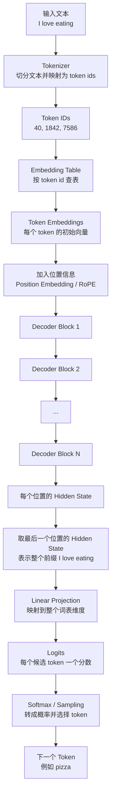
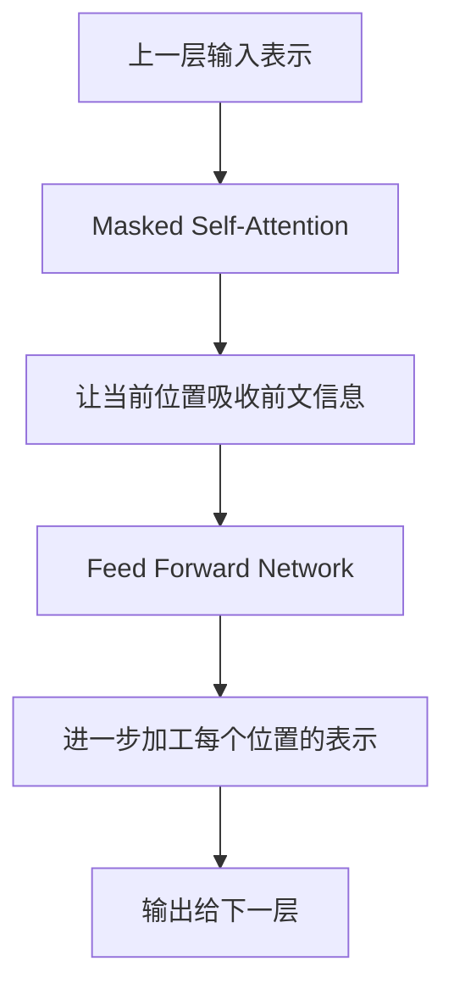
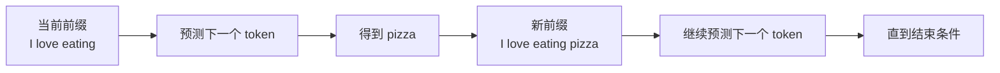

# Decoder-only Transformer 预测下一个 Token 流程图

## 1. 这张图在说明什么

这张图说明的是：

```text
一段输入文本进入 decoder-only Transformer 后，
模型如何得到“下一个 token 应该是什么”。
```

它不是完整训练流程，也不是 encoder-decoder Transformer 的完整结构图。这里关注的是 GPT 类模型在推理阶段的一次 next-token prediction。

## 2. 单步预测流程



关键点：

```text
模型预测下一个 token 时，
真正使用的是最后一个位置的上下文 hidden state，
不是原始 token id，也不是最初的 token embedding。
```

## 3. Decoder Block 内部在做什么

每个 decoder block 可以粗略理解为两类处理：



在 decoder-only 模型里，masked self-attention 有一个核心约束：

```text
当前位置只能看见自己和它前面的 token，不能看见未来 token。
```

例如输入是：

```text
I love eating
```

那么各位置能看到的内容是：

| 位置  | 当前 token | 可以看到的上下文      |
| --- | -------- | ------------- |
| 1   | I        | I             |
| 2   | love     | I love        |
| 3   | eating   | I love eating |

因此，最后一个位置 `eating` 的 hidden state 会携带整个前缀 `I love eating` 的上下文信息。

## 4. 生成不是一次完成，而是循环完成

模型每次只预测一个下一个 token。预测完成后，会把新 token 拼回输入，再继续预测。



所以 LLM 的生成过程可以理解为：

```text
读入已有前缀
预测下一个 token
把新 token 接到前缀后面
继续预测下一个 token
```

## 5. 和 Attention Is All You Need 的关系

`Attention Is All You Need` 原文介绍的是 encoder-decoder Transformer，主要面向机器翻译任务。

GPT 类模型使用的是 decoder-only 架构，可以理解为：

```text
保留 Transformer decoder 中适合自回归生成的部分，
去掉 encoder 和 encoder-decoder cross-attention，
用 masked self-attention 从左到右预测下一个 token。
```

因此，读原文时可以重点把握：

-   self-attention 如何让 token 之间交换信息。
-   positional encoding 为什么需要补充顺序信息。
-   mask 为什么能防止模型看到未来 token。
-   最终输出为什么可以映射为词表上的预测分数。

## 6. 一句话总结

```text
decoder-only Transformer 的单步推理，
就是把输入前缀变成最后一个位置的上下文 hidden state，
再用这个 hidden state 去预测词表中最可能出现的下一个 token。
```
