> 用途：作为本地 Codex / OpenCode / Claude Code 会话的上下文文档，用于继续讨论 Agentic OS、Agent Runtime、LLM 基础、Agent 工程化、源码阅读与个人职业转型。

---

## 0. 核心结论

职业方向不应绑定 Android。

更合理的目标是：

```text
Agent Runtime / Agentic System Engineer
```

也可以表述为：

```text
具备复杂客户端与设备侧系统经验的 Agent Runtime 工程师
```

Android 是已有经验资产，不是未来职业边界。它可以作为第一个真实验证场景，但不能成为长期定位本身。

```mermaid
flowchart LR
    A[&#34;已有经验<br/>Android / 客户端 / 设备能力&#34;] --> B[&#34;可迁移能力<br/>异步 / 状态机 / 权限 / 工程化&#34;]
    B --> C[&#34;主攻方向<br/>LLM 应用基础 + Agent Runtime&#34;]
    C --> D[&#34;职业定位<br/>Agentic System Engineer&#34;]
    C --> E[&#34;可选验证场景<br/>Android / 桌面 / 企业流程 / 浏览器 / IoT&#34;]
```

真正要建立的壁垒不是继续做 Android 页面业务，也不是硬转 LLM 训练，而是掌握：

- LLM 在系统中的行为边界
- Tool Calling 与 MCP 类工具系统
- Context 管理
- Memory 设计
- Planner / Executor
- Runtime 状态机
- 权限、沙箱、审计、回放
- 失败恢复与结果验证
- 长任务和多步骤任务的工程化

---

## 1. 个人背景与方向修正

### 1.1 当前背景

- Android 研发工程师，约 14 年客户端开发经验。
- 熟悉 Android App 业务开发、架构设计、异步任务、协程、状态机、BLE、工程化协作。
- 当前主要工作领域：运动健康 App，配合智能手表进行数据同步、设备连接、健康能力承载。
- 对软件架构、AI Agent、Agent Runtime、Agentic OS、端侧智能方向感兴趣。
- 职业困惑：
  - Android 岗位增长放缓。
  - 纯业务开发价值感下降。
  - 希望寻找未来 5 到 10 年仍有增长空间的技术方向。
  - 不希望盲目转向与既有积累割裂过大的方向。

### 1.2 不再采用的定位

不建议把主定位写成：

```text
Android + Agent
Android Agent 工程师
Android 架构师 + Agent Runtime
```

原因：

- 容易把未来边界锁死在 Android 上。
- Agentic OS / Agent Runtime 的核心问题不是 Android 专属问题。
- 未来更 AI 化的系统形态可能弱化传统 App 和传统 Android 交互模式。

### 1.3 建议采用的定位

建议定位：

```text
Agent Runtime / Agentic System Engineer
```

补充说明：

```text
以 LLM 应用基础为底座
以 Agent Runtime 为主线
以真实工程系统为验证场
以 Android 经验作为差异化资产
```

### 1.4 Android 在路线中的位置

Android 不作为主线，不作为终局，只作为可选验证场景。

```mermaid
flowchart TB
    A[&#34;职业主线<br/>Agent Runtime&#34;] --> B[&#34;通用能力&#34;]
    B --> B1[&#34;Tool System&#34;]
    B --> B2[&#34;Memory&#34;]
    B --> B3[&#34;Context&#34;]
    B --> B4[&#34;Planner / Executor&#34;]
    B --> B5[&#34;Sandbox / Policy&#34;]
    B --> B6[&#34;Observability&#34;]

    A --> C[&#34;验证场景&#34;]
    C --> C1[&#34;Android Log Agent&#34;]
    C --> C2[&#34;Coding Agent&#34;]
    C --> C3[&#34;Browser Agent&#34;]
    C --> C4[&#34;Enterprise Workflow Agent&#34;]
    C --> C5[&#34;Device Capability Agent&#34;]
```

判断标准：

- 如果一个项目只能证明“我懂 Android”，价值有限。
- 如果一个项目能证明“我懂 Agent Runtime，并且能把 Android 当成一个复杂工具环境接入”，价值较高。

---

## 2. 基本概念关系

### 2.1 概念分层

```mermaid
flowchart TB
    LLM[&#34;LLM<br/>语言模型&#34;] --> Agent[&#34;Agent<br/>带目标的执行体&#34;]
    Agent --> Framework[&#34;Agent Framework<br/>开发框架&#34;]
    Framework --> Runtime[&#34;Agent Runtime<br/>运行时系统&#34;]
    Runtime --> AgenticOS[&#34;Agentic OS<br/>更高层系统愿景&#34;]

    LLM -.提供.-> Reason[&#34;推理 / 生成 / 结构化输出&#34;]
    Agent -.包含.-> Loop[&#34;Agent Loop&#34;]
    Agent -.使用.-> Tool[&#34;Tool Calling&#34;]
    Runtime -.管理.-> Task[&#34;Task / State / Memory / Tool / Event&#34;]
    AgenticOS -.整合.-> Ecosystem[&#34;Runtime + Capability + Policy + Multi-Agent&#34;]
```

### 2.2 LLM 不是 Agent

LLM 负责生成和推理，但它本身不负责：

- 长期任务状态
- 工具注册与权限
- 外部系统调用
- 失败恢复
- 任务审计
- 跨会话记忆
- 执行结果验证

Agent 是把 LLM 放进执行闭环之后形成的系统。

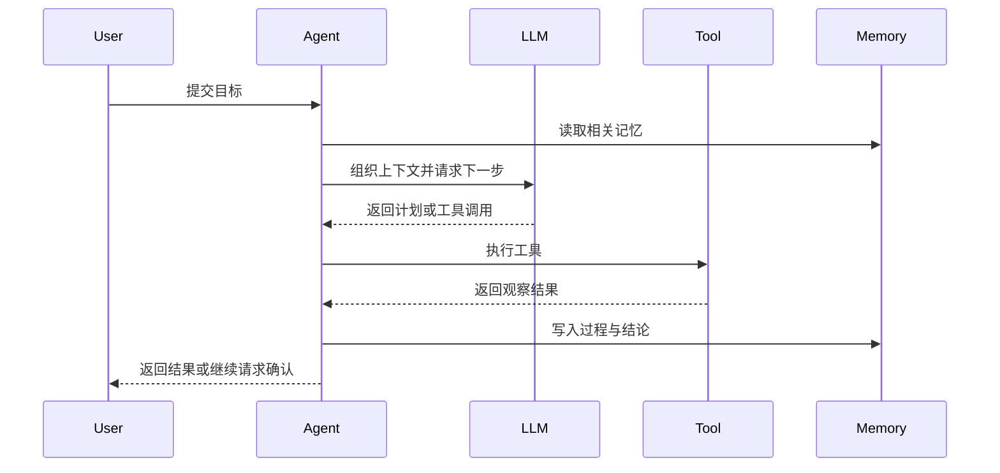

### 2.3 Agent Framework 与 Agent Runtime

Agent Framework 解决“如何更方便地写 Agent”。

Agent Runtime 解决“如何让 Agent 稳定、可控、可恢复地运行”。

```text
Framework 更像 SDK
Runtime 更像运行环境和执行系统
```

职业上更有长期壁垒的是 Runtime 能力。

### 2.4 Agentic OS

Agentic OS 是更高层愿景，不是现在就要直接实现的目标。

它可以理解为：

```text
Agent Runtime
    + Tool / Capability Layer
    + Memory System
    + Scheduler
    + Policy / Permission
    + Multi-Agent Communication
    + Observability
    + Knowledge Store
```

```mermaid
flowchart TB
    subgraph OS[&#34;Agentic OS 愿景层&#34;]
        Portal[&#34;用户意图入口&#34;]
        Runtime[&#34;Agent Runtime&#34;]
        Cap[&#34;Capability Layer&#34;]
        Policy[&#34;Policy / Permission&#34;]
        Memory[&#34;Long-term Memory&#34;]
        Multi[&#34;Multi-Agent Communication&#34;]
    end

    Portal --> Runtime
    Runtime --> Cap
    Runtime --> Memory
    Runtime --> Multi
    Policy --> Runtime
    Policy --> Cap

    Cap --> Apps[&#34;Apps / APIs&#34;]
    Cap --> Device[&#34;Device / Sensors&#34;]
    Cap --> Web[&#34;Web / Browser&#34;]
    Cap --> Files[&#34;Files / Knowledge&#34;]
    Cap --> Enterprise[&#34;Enterprise Systems&#34;]
```

---

## 3. 能力树

主线能力是 LLM 基础和 Agent Runtime。

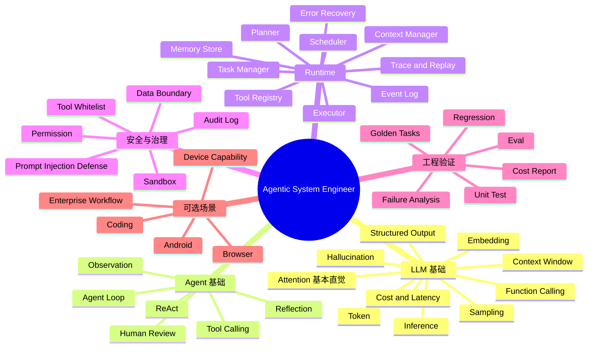

---

## 4. 学习原则

### 4.1 主线优先

学习优先级：

```text
LLM 基础
    → Tool Calling
    → Agent Loop
    → Context / Memory
    → Runtime 状态机
    → 失败恢复与验证
    → 源码阅读
    → 自己实现 Mini Runtime
```

不要过早把精力分散到太多框架。

### 4.2 不建议主攻的方向

不建议把主学习路线设为：

- LLM 算法研究员
- 大模型训练工程师
- CUDA 工程师
- Transformer 底层研究员
- RLHF / LoRA / 模型训练专家
- 纯 Prompt Engineering

原因：

- 与当前工程经验迁移关系较弱。
- 学习投入高，但短中期职业收益不一定最大。
- 纯 Prompt 门槛低，难以形成长期壁垒。

### 4.3 框架选择原则

前 6 个月只需要：

- 一个主开发框架：OpenAI Agents SDK 或 LangGraph 二选一。
- 一个源码阅读对象：OpenHands / OpenClaw / Hermes 三选一。
- 一个自研 Runtime MVP。

其他框架作为横向了解，不作为主线。

---

## 5. Agent Runtime 目标架构

学习 Agent Runtime 时，要始终围绕下面这张图理解。

```mermaid
flowchart TB
    U[&#34;User Task&#34;] --> TM[&#34;Task Manager&#34;]
    TM --> CM[&#34;Context Manager&#34;]
    CM --> MG[&#34;Model Gateway&#34;]
    MG --> PL[&#34;Planner&#34;]
    PL --> EX[&#34;Executor&#34;]
    EX --> TR[&#34;Tool Registry&#34;]
    TR --> SB[&#34;Sandbox / Policy&#34;]
    SB --> TOOL[&#34;Tools / MCP / APIs / Shell&#34;]
    TOOL --> OBS[&#34;Observation&#34;]
    OBS --> EX
    EX --> EV[&#34;Evaluator / Verifier&#34;]
    EV -->|pass| OUT[&#34;Final Answer / Report&#34;]
    EV -->|fail| REC[&#34;Recovery Strategy&#34;]
    REC --> PL

    MEM[&#34;Memory Store&#34;] <--> CM
    LOG[&#34;Event Log / Trace&#34;] <--> TM
    LOG <--> EX
    LOG <--> EV
    SCH[&#34;Scheduler&#34;] --> TM
```

核心模块职责：

| 模块 | 作用 | 学习重点 |
|---|---|---|
| Task Manager | 管理任务生命周期 | 状态机、任务队列、取消、恢复 |
| Planner | 拆解任务和决定下一步 | 计划粒度、约束、动态调整 |
| Executor | 执行计划和工具调用 | 串并行、重试、超时 |
| Tool Registry | 注册和描述工具 | Schema、权限、工具发现 |
| Context Manager | 组织 LLM 输入上下文 | 压缩、检索、优先级 |
| Memory Store | 保存长期经验和事实 | 结构化记忆、检索、更新 |
| Event Log | 记录全过程 | 可观测、回放、调试 |
| Evaluator | 检查结果是否可靠 | 自动验证、人工确认、回归测试 |
| Policy / Sandbox | 控制风险 | 权限、隔离、危险操作确认 |
| Scheduler | 支持长任务 | 定时、恢复、后台执行 |

### 5.1 Runtime 状态机

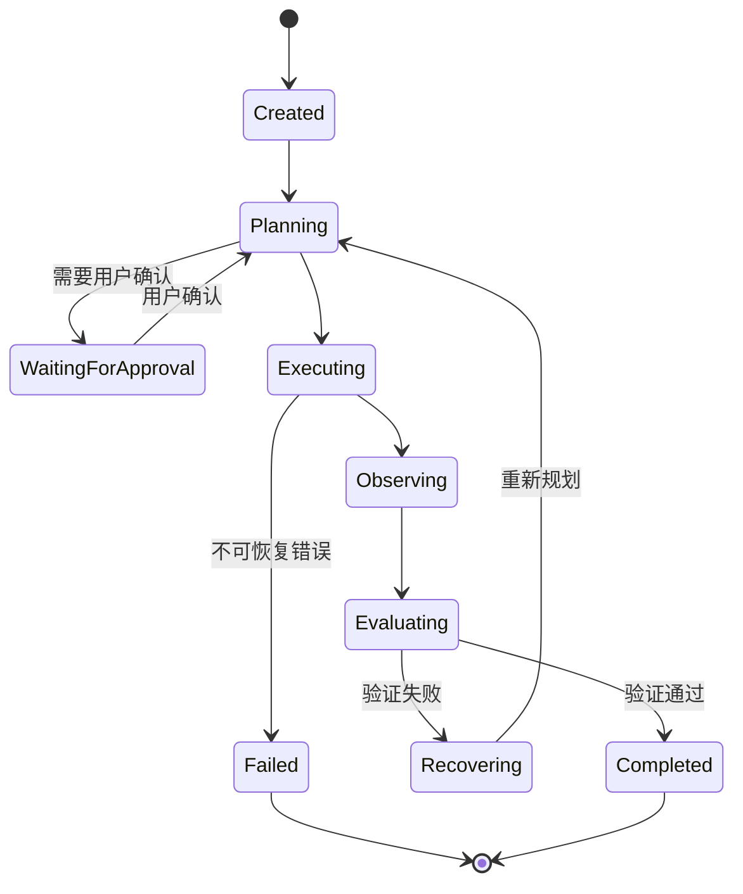

### 5.2 Agent Loop 最小闭环

```mermaid
flowchart LR
    A[&#34;Goal&#34;] --> B[&#34;Build Context&#34;]
    B --> C[&#34;LLM Decides&#34;]
    C --> D{&#34;Need Tool?&#34;}
    D -->|Yes| E[&#34;Call Tool&#34;]
    E --> F[&#34;Observation&#34;]
    F --> B
    D -->|No| G[&#34;Draft Answer&#34;]
    G --> H[&#34;Verify&#34;]
    H --> I{&#34;Pass?&#34;}
    I -->|Yes| J[&#34;Final&#34;]
    I -->|No| B
```

---

## 6. 6 个月学习计划

假设每周投入约 10 小时：

- 工作日：每天 1 小时
- 周末：合计 4 到 5 小时

目标不是“学完所有框架”，而是在 6 个月后能独立设计并实现一个简化版 Agent Runtime。

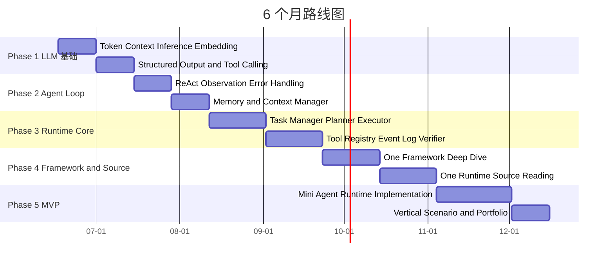

### 第 1 个月：LLM 基础

目标：

```text
理解 LLM 的能力边界，能解释为什么 LLM 只是 Agent 的一个组件。
```

学习内容：

- Token
- Embedding
- Attention 的基本直觉
- Context Window
- KV Cache
- Inference
- Sampling
- System / User / Assistant Message
- Structured Output
- Function Calling / Tool Calling
- Hallucination
- Latency and Cost

不需要深入：

- 反向传播
- 分布式训练
- CUDA kernel
- 大规模预训练
- RLHF 细节

实践任务：

- 写一个最小 LLM client。
- 支持普通问答。
- 支持 structured JSON 输出。
- 支持一个 `calculator` 工具。
- 记录每次请求的输入、输出、耗时、token 用量。

验收标准：

- 能解释 Context Window 和 Memory 的区别。
- 能解释 Function Calling 和普通文本输出的区别。
- 能说明 LLM 为什么会产生幻觉，以及系统层如何缓解。
- 能写出一个最小可运行的 tool calling demo。

### 第 2 个月：Agent Loop、Tool、Memory

目标：

```text
从“调用模型”进入“构建执行闭环”。
```

学习内容：

- ReAct
- Thought / Action / Observation 的工程化表达
- Tool Schema
- Tool Result
- Tool Error
- Tool Permission
- Short-term Memory
- Long-term Memory
- Semantic Memory
- Episodic Memory
- Context Compression

实践任务：

实现一个最小 Agent Loop：

```text
输入目标
构建上下文
调用 LLM
解析工具调用
执行工具
写入观察结果
判断是否完成
输出报告
```

至少实现 4 个工具：

- `calculator`
- `file_search`
- `read_file`
- `shell_command_safe`

验收标准：

- 工具调用失败后能重试或降级。
- 每一步都有 event log。
- 任务结束后能生成执行报告。
- 新任务可以检索历史任务结论。

### 第 3 个月：Agent Runtime Core

目标：

```text
把 Agent 从 demo 改造成可管理、可恢复、可观察的 runtime。
```

学习内容：

- Task Manager
- Planner
- Executor
- Tool Registry
- Context Manager
- Memory Store
- Event Log
- Evaluator
- Retry Policy
- Task State Machine

实践任务：

实现 `mini-agent-runtime` 的第一版：

```text
mini-agent-runtime/
├── runtime/
│   ├── task_manager.py
│   ├── planner.py
│   ├── executor.py
│   ├── context_manager.py
│   ├── tool_registry.py
│   ├── memory_store.py
│   ├── event_log.py
│   └── verifier.py
├── tools/
├── examples/
└── tests/
```

建议技术：

- Python
- uv 或 venv
- SQLite
- JSONL event log
- pytest
- CLI

验收标准：

- 一个复杂任务可以被拆成多个步骤。
- 每个步骤有状态、输入、输出、错误信息。
- 可以从 event log 回放一次任务。
- 工具有 schema 和权限等级。
- 至少有 10 个 golden task 用于回归测试。

### 第 4 个月：框架和源码阅读

目标：

```text
理解成熟项目如何组织 Agent Runtime，而不是盲目堆框架。
```

框架只选一个深入：

- OpenAI Agents SDK
- LangGraph

源码只选一个深入：

- OpenHands
- OpenClaw
- Hermes

源码阅读固定回答 7 个问题：

1. Task 从哪里进入？
2. Agent Loop 在哪里？
3. Planner 在哪里？
4. Tool 如何注册？
5. Tool 如何调用？
6. Memory 如何读写？
7. 错误如何恢复？

输出物：

- 一张模块图。
- 一张时序图。
- 一张状态图。
- 一份核心调用链说明。

源码阅读模板：

```mermaid
flowchart TD
    Entry[&#34;Task Entry&#34;] --> Loop[&#34;Agent Loop&#34;]
    Loop --> Plan[&#34;Planner&#34;]
    Plan --> Exec[&#34;Executor&#34;]
    Exec --> Tool[&#34;Tool Call&#34;]
    Tool --> Obs[&#34;Observation&#34;]
    Obs --> Context[&#34;Context Update&#34;]
    Context --> Loop
    Loop --> Done[&#34;Final / Stop&#34;]
```

### 第 5 个月：Mini Runtime 完整化

目标：

```text
做出一个能展示 Runtime 能力的个人项目，而不是普通 Agent demo。
```

必须具备：

- CLI 入口
- Task Manager
- Planner
- Executor
- Tool Registry
- Context Manager
- Memory Store
- Event Log
- Verifier
- Retry / Recovery
- 简单权限模型
- 任务报告

暂时不做：

- Web UI
- 多用户
- 插件市场
- 分布式执行
- 复杂向量数据库
- 完整 MCP 生态

验收任务示例：

```text
读取一个小型代码仓
总结目录结构
找出潜在问题
调用 shell 运行测试
读取测试结果
生成修复建议
保存任务记忆
输出可追溯报告
```

### 第 6 个月：垂直场景和作品化

目标：

```text
用一个真实场景证明 Runtime 能力。
```

候选场景：

- Android Log 分析 Agent
- Android 自动化测试 Agent
- Coding Repo Review Agent
- Browser Research Agent
- 本地知识库 Agent

选择原则：

- 能证明 Runtime，而不是只证明提示词。
- 能体现工具调用、记忆、回放、失败恢复。
- 能产生可展示的报告、图和测试结果。
- 能和当前工作经验形成差异化，但不绑定 Android。

推荐第一项目：

```text
Coding Repo Review Agent
```

原因：

- 不被 Android 限定。
- 更接近 Agent Runtime 通用能力。
- 容易用公开代码仓演示。
- 能验证文件读取、搜索、shell、测试、报告、记忆。

Android 相关项目可以作为第二项目：

```text
Android Log / Test Agent
```

它用于体现设备侧经验，但不是职业主线。

---

## 7. 项目路线

```mermaid
flowchart LR
    P1[&#34;Project 1<br/>LLM Tool Calling Lab&#34;] --> P2[&#34;Project 2<br/>Minimal Agent Loop&#34;]
    P2 --> P3[&#34;Project 3<br/>Mini Agent Runtime&#34;]
    P3 --> P4[&#34;Project 4<br/>Coding Repo Review Agent&#34;]
    P3 --> P5[&#34;Project 5<br/>Android Log/Test Agent&#34;]
    P4 --> Portfolio[&#34;Portfolio<br/>Runtime 架构图 + Demo + Tests + Report&#34;]
    P5 --> Portfolio
```

### Project 1：LLM Tool Calling Lab

目标：

- 熟悉 LLM API。
- 熟悉 structured output。
- 熟悉 function calling。
- 记录 token、耗时、错误。

产出：

- `llm_client.py`
- `tools/calculator.py`
- `examples/tool_calling_demo.py`
- `logs/*.jsonl`

### Project 2：Minimal Agent Loop

目标：

- 实现最小 Agent Loop。
- 支持工具调用和观察结果。
- 支持失败重试。

产出：

- `agent_loop.py`
- `tool_registry.py`
- `event_log.py`
- 5 个示例任务。

### Project 3：Mini Agent Runtime

目标：

- 从 demo 变成 runtime。
- 支持任务状态、上下文、记忆、回放、验证。

产出：

- 可运行 CLI。
- 架构图。
- 10 个 golden tasks。
- 任务回放日志。
- 设计说明。

### Project 4：Coding Repo Review Agent

目标：

- 读取代码仓。
- 搜索关键文件。
- 运行测试或静态检查。
- 输出问题列表和证据。

产出：

- Repo 分析报告。
- 工具调用 trace。
- 失败恢复示例。

### Project 5：Android Log/Test Agent

目标：

- 把 Android 作为复杂工具环境接入 runtime。
- 不把职业定位绑定 Android。

能力：

- 读取 logcat。
- 解析 Crash / ANR / OOM。
- 调用 adb / gradle / maestro。
- 生成排查报告。

产出：

- Android 场景 demo。
- 设备能力 tool schema。
- 权限和风险说明。

---

## 8. 评价标准

### 8.1 第 1 个月结束

必须能回答：

- LLM 和 Agent 的区别是什么？
- Context Window 和 Memory 的区别是什么？
- Function Calling 为什么比纯文本工具调用更可靠？
- 幻觉为什么不能只靠提示词解决？
- token、延迟、成本如何影响系统设计？

必须有：

- 一个 tool calling demo。
- 一份请求日志。
- 一个 structured output 示例。

### 8.2 第 2 个月结束

必须能回答：

- ReAct 为什么需要 Observation？
- 工具失败后 Agent 应该如何处理？
- Memory 应该保存事实、偏好、经验还是原始对话？
- Context Manager 如何决定放什么进上下文？

必须有：

- 一个最小 Agent Loop。
- 4 个工具。
- event log。
- 简单 memory。

### 8.3 第 3 个月结束

必须能回答：

- Task Manager 和 Executor 的边界是什么？
- Planner 输出应该是自然语言、JSON，还是内部对象？
- Tool Registry 应该如何描述权限？
- Event Log 如何支持回放？
- Verifier 如何减少错误结果？

必须有：

- `mini-agent-runtime` 第一版。
- 状态机。
- SQLite 或 JSONL 记忆。
- 10 个 golden tasks。

### 8.4 第 4 个月结束

必须能回答：

- 所选框架如何组织 Agent、Tool、Runner、Trace？
- 所选源码项目的主调用链是什么？
- 它如何处理工具调用、上下文和错误？
- 它有哪些设计可以迁移到你的 runtime？

必须有：

- 源码阅读报告。
- 模块图。
- 时序图。
- 状态图。

### 8.5 第 5-6 个月结束

必须能展示：

- 一个可运行 runtime。
- 一个真实垂直场景。
- 一套回归任务。
- 一份 trace/report。
- 一次失败恢复案例。
- 一份设计取舍说明。

最终验收句：

```text
我不是只会调 LLM API。
我能设计一个可观察、可恢复、可验证的 Agent Runtime。
```

---

## 9. 学习材料和源码阅读策略

### 9.1 阅读顺序

```mermaid
flowchart TD
    A[&#34;先看 README / Docs&#34;] --> B[&#34;看目录结构&#34;]
    B --> C[&#34;找核心抽象&#34;]
    C --> D[&#34;找 Task Entry&#34;]
    D --> E[&#34;找 Agent Loop&#34;]
    E --> F[&#34;找 Tool Call&#34;]
    F --> G[&#34;找 Memory / Context&#34;]
    G --> H[&#34;找 Error Handling&#34;]
    H --> I[&#34;输出架构图&#34;]
```

### 9.2 不要从 main 函数一路读到底

大型 Agent 项目不能像普通 demo 一样读。每次只围绕一个问题读：

- 任务怎么进入？
- 状态在哪里？
- LLM 输入在哪里构造？
- 工具在哪里注册？
- 工具返回如何进入上下文？
- 错误如何恢复？
- trace 如何记录？

### 9.3 每读一个项目都产出三张图

模块图：

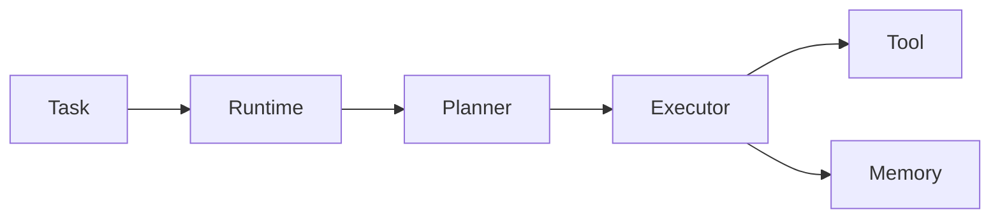

时序图：

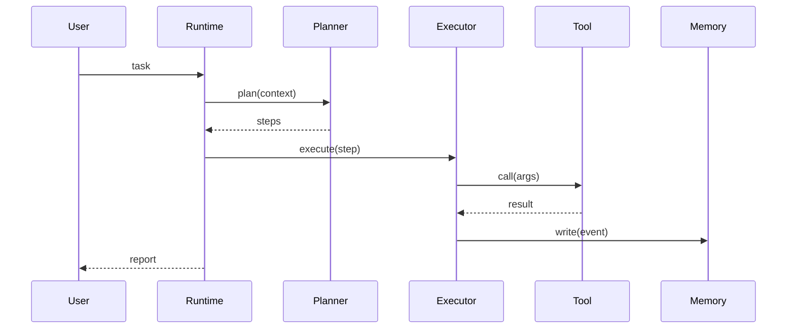

状态图：

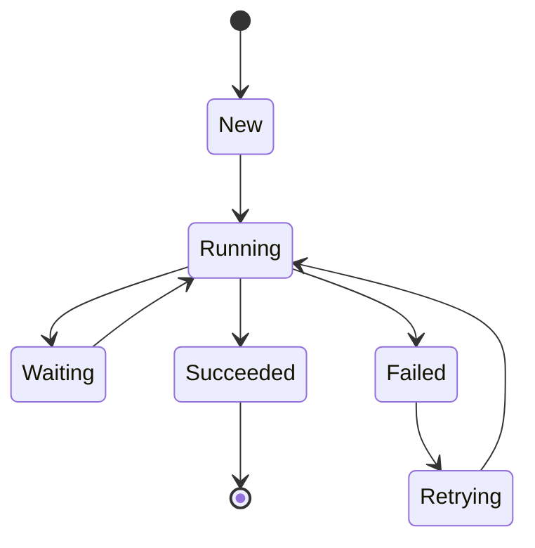

---

## 10. 技术栈建议

### 10.1 主环境

建议：

```text
WSL / Ubuntu
```

原因：

- Agent 生态偏 Linux-first。
- shell、Docker、Python、MCP、源码阅读更顺。
- 和 Codex / OpenCode / Claude Code 等 CLI 工具契合。

### 10.2 Python 环境

优先使用项目虚拟环境：

```bash
python3 -m venv venv
source venv/bin/activate
pip install ...
```

也可以使用 `uv`，但不要在系统 Python 中随意安装依赖。

### 10.3 工具链

必备：

- Git
- Python
- pytest
- SQLite
- jq
- rg
- curl
- Docker
- tmux

Agent 相关：

- OpenAI API / Agents SDK
- LangGraph
- MCP 基础
- JSON Schema
- JSONL event log

可选：

- Codex CLI
- OpenCode
- Claude Code
- Aider

---

## 11. 风险和纠偏

### 11.1 风险：概念过大

Agentic OS 是愿景，不是前 6 个月的工程目标。

纠偏：

```text
先做 Mini Agent Runtime
再讨论 Agentic OS
```

### 11.2 风险：框架过多

不要同时深入 OpenAI Agents SDK、LangGraph、AutoGen、CrewAI、LangChain。

纠偏：

```text
主框架只选一个
源码项目只读一个
自研 runtime 必须做
```

### 11.3 风险：只会调 API

只会调用模型 API 不是竞争力。

纠偏：

```text
每个项目都必须有状态、工具、记忆、日志、验证、失败恢复
```

### 11.4 风险：重新绑定 Android

Android 项目容易让职业叙事回到旧轨道。

纠偏：

```text
Android 是验证场景
不是职业标签
```

### 11.5 风险：忽视验证

Agent 的核心问题不是能不能生成答案，而是答案能不能被验证。

纠偏：

```text
每个任务都要有 verifier
每个版本都要有 golden tasks
每次失败都要进入 event log
```

---

## 12. 最终路线

```mermaid
flowchart TB
    Start[&#34;当前状态<br/>资深 Android / 客户端工程师&#34;] --> Shift[&#34;定位修正<br/>不绑定 Android&#34;]
    Shift --> Base[&#34;LLM 基础<br/>Token / Context / Tool Calling&#34;]
    Base --> Loop[&#34;Agent Loop<br/>ReAct / Tool / Observation&#34;]
    Loop --> Runtime[&#34;Agent Runtime<br/>Task / Planner / Executor / Memory&#34;]
    Runtime --> Source[&#34;源码阅读<br/>一个框架 + 一个 Runtime 项目&#34;]
    Source --> MVP[&#34;Mini Agent Runtime<br/>可运行 / 可回放 / 可验证&#34;]
    MVP --> Portfolio[&#34;作品集<br/>通用 Runtime + 垂直场景&#34;]
    Portfolio --> Career[&#34;Agent Runtime / Agentic System Engineer&#34;]
```

最终判断：

这个方向有前景，但不能靠概念取胜。真正有价值的路径是：

```text
用 LLM 基础理解模型边界
用 Agent Loop 理解执行闭环
用 Agent Runtime 建立工程壁垒
用可验证项目证明能力
```

Android 经验应被保留为差异化资产，但不应成为职业边界。

最重要的 6 个月目标：

```text
完成一个 Mini Agent Runtime，
并用一个真实场景证明它能稳定完成多步骤任务。
```

---

## 13. 当前阶段细化：Week1 LLM 基础认知

> 本节是 6 个月计划中 Phase 1（第 1 个月）的第一周细化，目标不是把 LLM 全部学完，而是建立 Agent Runtime 后续会反复用到的基础认知。

### 学习目标

- Token / Tokenizer
- Embedding
- Attention / Self-Attention
- Context Window
- KV Cache
- Memory / Retrieval / State

本周结束时，需要能够回答：

1.  为什么 LLM 有上下文限制？
2.  为什么长上下文会变慢、变贵？
3.  为什么 Agent 不能只依赖 prompt，需要 Memory / Retrieval / State？

### 学习内容

#### 1. Token / Tokenizer

需要理解：

-   文本如何被切分成 token。
-   token 和字符、单词并不是一回事。
-   中文、英文、代码的 token 数可能差异很大。
-   token 数会影响上下文窗口、推理成本和响应延迟。

建议实践：

-   使用 OpenAI `tiktoken` 统计几段中文、英文、代码片段的 token 数。
-   对比同一段需求描述在中文、英文、代码注释中的 token 差异。

推荐资源：

-   OpenAI Cookbook: How to count tokens with tiktoken  
    <https://cookbook.openai.com/examples/how_to_count_tokens_with_tiktoken>
-   Karpathy: Let's build the GPT Tokenizer  
    <https://karpathy.ai/zero-to-hero.html>

#### 2. Embedding

需要理解：

-   token id 只是离散编号，不是语义本身。
-   embedding 是模型内部处理 token 的向量表示。
-   LLM 的输入可以理解为 token embedding 加上位置信息。
-   这里重点不是向量数据库，而是文本如何进入神经网络。

建议掌握到能解释即可，不需要深入训练算法。

推荐资源：

-   Contextual Word Representations: A Contextual Introduction  
    <https://arxiv.org/abs/1902.06006>
-   Efficient Estimation of Word Representations in Vector Space  
    <https://arxiv.org/abs/1301.3781>

#### 3. Decoder-only Transformer 基本结构

需要理解：

-   token embedding
-   position encoding / RoPE
-   masked self-attention
-   multi-head attention
-   FFN
-   residual connection
-   layer norm
-   next-token prediction

重点是理解推理链路：

```
文本 -> token -> embedding -> transformer blocks -> logits -> next token
```

推荐资源：

-   Attention Is All You Need  
    <https://arxiv.org/abs/1706.03762>
-   Google Research: Transformer: A Novel Neural Network Architecture for Language Understanding  
    <https://research.google/blog/transformer-a-novel-neural-network-architecture-for-language-understanding/>
-   Karpathy: Let's build GPT: from scratch, in code, spelled out  
    <https://www.youtube.com/watch?v=kCc8FmEb1nY>

#### 4. Attention / Self-Attention

需要理解：

-   Q / K / V 分别是什么。
-   attention score 如何表示 token 之间的相关性。
-   causal mask 为什么能保证模型从左到右生成。
-   multi-head attention 为什么可以看作多组关系建模。
-   为什么 attention 计算会随着上下文长度增长而变贵。

建议阅读顺序：

1.  先读 Google Research 的 Transformer 文章，建立直觉。
2.  再读《Attention Is All You Need》的 Abstract、Introduction、Figure 1 和 Attention 部分。
3.  最后用 Karpathy 的 GPT 视频把概念对应到代码。

#### 5. Context Window

需要理解：

-   Context Window 是模型一次推理能看到的 token 范围。
-   长上下文不是长期记忆。
-   上下文越长，prefill 成本越高，attention 和 KV cache 压力越大。
-   相关信息放在上下文中间时，模型不一定能稳定使用。

推荐资源：

-   Lost in the Middle: How Language Models Use Long Contexts  
    <https://arxiv.org/abs/2307.03172>

本节要形成一个判断：

> Context Window 是运行时资源，不是 Memory 的替代品。

#### 6. KV Cache

需要理解：

-   推理通常分为 prefill 和 decode。
-   prefill 处理已有上下文。
-   decode 逐 token 生成新内容。
-   KV cache 缓存历史 token 的 key/value，避免每生成一个 token 都重复计算全部历史。
-   KV cache 会随上下文长度、batch size、模型层数增长，占用大量显存。

从 Agent Runtime 角度，需要特别关注：

-   长会话为什么昂贵。
-   多任务并发为什么会受 KV cache 限制。
-   为什么 runtime 需要做 context management、summary、memory retrieval。

推荐资源：

-   Hugging Face Transformers: Caching  
    <https://huggingface.co/docs/transformers/main/cache_explanation>
-   Hugging Face Transformers: KV cache strategies  
    <https://huggingface.co/docs/transformers/en/kv_cache>
-   vLLM: Automatic Prefix Caching  
    <https://docs.vllm.ai/en/latest/design/prefix_caching/>
-   Efficient Memory Management for Large Language Model Serving with PagedAttention（选读，只看 Abstract、Introduction 和核心图即可）  
    <https://arxiv.org/abs/2309.06180>

建议阅读顺序：

1.  先读 Hugging Face 的 Caching 文档，建立 prefill / decode / KV cache 的基本直觉。
2.  再读 Hugging Face 的 KV cache strategies，理解 Dynamic Cache、Static Cache、Quantized Cache 的取舍即可，不需要记 API。
3.  再读 vLLM 的 Automatic Prefix Caching，理解相同 prompt prefix 为什么可以复用 KV cache。
4.  最后选读 PagedAttention 论文，只关注它要解决 KV cache 过大、动态增长和显存碎片的问题。

本节验收问题：

1.  prefill 和 decode 有什么区别？
2.  KV cache 缓存的 key / value 是什么？
3.  KV cache 为什么能加速逐 token 生成？
4.  KV cache 为什么会随上下文长度、模型层数和并发任务数增长？
5.  为什么 Agent Runtime 不能无限堆长上下文？

本节不建议深入：

-   CUDA kernel。
-   PagedAttention 的底层分页实现。
-   推理引擎的显存调度细节。
-   不同 serving 框架的完整 API。

#### 7. 为什么 Agent 需要 Memory

需要区分三类状态：

-   Context Window：当前这次推理能看到的内容。
-   Retrieval / RAG：从外部知识库取回相关信息，再放进上下文。
-   Long-term Memory：跨任务、跨会话保留的用户偏好、事实、项目经验或工作状态。

关键理解：

-   LLM 的参数记忆不可控、不可精确更新。
-   Prompt 上下文有限，而且会变贵。
-   Agent 需要在任务执行过程中维护状态，而不仅是一次性问答。

推荐资源：

-   Retrieval-Augmented Generation for Knowledge-Intensive NLP Tasks  
    <https://arxiv.org/abs/2005.11401>

### Week1 推荐资源清单

#### 必读

-   Attention Is All You Need  
    <https://arxiv.org/abs/1706.03762>
-   Google Research: Transformer: A Novel Neural Network Architecture for Language Understanding  
    <https://research.google/blog/transformer-a-novel-neural-network-architecture-for-language-understanding/>
-   OpenAI Cookbook: How to count tokens with tiktoken  
    <https://cookbook.openai.com/examples/how_to_count_tokens_with_tiktoken>
-   Contextual Word Representations: A Contextual Introduction  
    <https://arxiv.org/abs/1902.06006>
-   Hugging Face Transformers: Caching  
    <https://huggingface.co/docs/transformers/main/cache_explanation>
-   Stanford CS224N: Natural Language Processing with Deep Learning  
    <https://web.stanford.edu/class/cs224n/>
-   Karpathy: Neural Networks: Zero to Hero  
    <https://karpathy.ai/zero-to-hero.html>

#### 选读

-   Language Models are Few-Shot Learners  
    <https://arxiv.org/abs/2005.14165>
-   Efficient Estimation of Word Representations in Vector Space  
    <https://arxiv.org/abs/1301.3781>
-   RoFormer: Enhanced Transformer with Rotary Position Embedding  
    <https://arxiv.org/abs/2104.09864>
-   Lost in the Middle: How Language Models Use Long Contexts  
    <https://arxiv.org/abs/2307.03172>
-   Hugging Face Transformers: KV cache strategies  
    <https://huggingface.co/docs/transformers/en/kv_cache>
-   vLLM: Automatic Prefix Caching  
    <https://docs.vllm.ai/en/latest/design/prefix_caching/>
-   Efficient Memory Management for Large Language Model Serving with PagedAttention  
    <https://arxiv.org/abs/2309.06180>

### Week1 验收问题

完成本周学习后，用自己的话回答：

1.  为什么 LLM 有上下文限制？
2.  为什么长上下文会变慢？
3.  为什么长上下文不等于长期记忆？
4.  KV cache 解决了什么问题，又带来了什么资源压力？
5.  如果设计一个 Agent Runtime，哪些模块会直接受 token、context window、KV cache 影响？

### Week1 暂不深入

本周不建议深入：

-   CUDA
-   分布式训练
-   模型训练工程
-   FlashAttention 源码
-   RLHF 实现细节
-   大规模预训练数据工程

这些内容不是不重要，而是不属于 Week1 的目标。Week1 的重点是建立 Agent Runtime 需要的 LLM 推理认知。

---

## 14. 三个月方向验证检查点

> 本节整合此前的三个月验证路线。它用于尽早验证投入方向，不替代第 6 节的六个月主线和阶段顺序。

三个月结束时，需要能够判断：

1. 是否真正喜欢 Agent Runtime 的工程问题。
2. 既有客户端、异步、状态机和工程化经验能否迁移。
3. 该方向是否存在值得长期投入的真实场景。
4. 是否愿意在未来一至三年持续投入。

### 14.1 早期验证主题

在完成 Week1 的 LLM 推理基础后，可按下面主题逐步验证，不要求同时深入多个框架：

- Agent 基础：Planning、Tool Calling、Reflection、Memory，并输出 Agent 架构图。
- Framework：对比 OpenAI Agents SDK 与 LangGraph 的 State、Graph、Workflow，选择一个作为后续主框架。
- Multi-Agent：理解多角色协作、任务拆分和结果汇总的适用边界，不把多 Agent 当作默认方案。
- 运行时问题：Task、State、Retry、Timeout、Lifecycle、Scheduler、Memory、Tool Registry。
- 源码观察：以编码类 Agent 和通用执行型 Agent 为候选，围绕 Task、Planner、Tool Registry、Memory、Session、生命周期和状态管理回答第 9 节定义的问题。

### 14.2 验证产出

三个月内应逐步形成：

- 一张 Agent 架构图和一份框架取舍记录。
- Task Model、Lifecycle、Scheduler、Memory、Tool Registry 的设计说明或图。
- 一份源码运行时分析，说明调用链和错误恢复边界。
- 一个覆盖 Task、Lifecycle、Scheduler、Memory、Tool Registry、Agent Communication 的 Agent Runtime v1.0 设计草案。

Android Log / Test Agent 可以作为该 Runtime 的可选验证场景；它不改变本规划中 Agent Runtime / Agentic System Engineer 的主定位。
